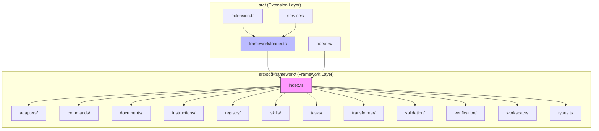

# Design Document: Inline sdd-framework

## Overview

This design describes how to move the `sdd-framework` source code from its current location as a git submodule (`deps/sdd-framework/`) into the main extension source tree at `src/sdd-framework/`. The migration involves:

1. Copying framework source files (excluding `cli.ts`) into `src/sdd-framework/`
2. Converting ESM import specifiers (removing `.js` extensions) to work under the extension's CommonJS tsconfig
3. Replacing the dynamic `import()` loader with direct TypeScript imports
4. Adding ESLint boundary rules to keep the framework runtime-agnostic
5. Migrating framework tests into the main test suite
6. Removing the git submodule, `file:` dependency, and related scripts

The key architectural principle: the framework module (`src/sdd-framework/`) is a self-contained, runtime-agnostic library. It never imports `vscode` or any file from the extension layer. The extension layer freely imports from the framework.

## Architecture



**Import direction is strictly one-way**: Extension → Framework. The ESLint boundary rule enforces this at lint time.

### Before vs After

| Aspect | Before (submodule) | After (inlined) |
|---|---|---|
| Location | `deps/sdd-framework/src/` | `src/sdd-framework/` |
| Module system | ESM (`NodeNext`) | CommonJS (via tsconfig) |
| Import style | `import('sdd-framework')` dynamic | Direct `import { X } from '../sdd-framework'` |
| Import specifiers | `'./foo.js'` (ESM) | `'./foo'` (Node resolution) |
| Build | Separate `tsc` in `deps/` | Single `tsc` from root |
| Tests | `deps/**/tests/**` globs | `src/sdd-framework/__tests__/**` |
| Dependency | `"sdd-framework": "file:deps/sdd-framework"` | None (direct source) |

## Components and Interfaces

### 1. Framework Module (`src/sdd-framework/`)

The inlined framework retains its existing internal structure. All internal imports switch from ESM `.js`-suffixed specifiers to extensionless specifiers compatible with `"moduleResolution": "node"`.

**Directory structure after migration:**

```
src/sdd-framework/
├── index.ts              # Barrel file (same exports as before)
├── types.ts              # Core type definitions
├── adapters/
│   ├── index.ts
│   ├── platform-adapter.ts
│   ├── kiro-adapter.ts
│   ├── claude-code-adapter.ts
│   ├── codex-adapter.ts
│   ├── antigravity-adapter.ts
│   └── amazonq-adapter.ts
├── commands/
│   ├── index.ts
│   ├── clipboard.ts
│   ├── command-result.ts
│   ├── create-spec-command.ts
│   ├── install-skills-command.ts
│   ├── output-formatter.ts
│   ├── refine-command.ts
│   ├── run-task-command.ts
│   ├── start-group-command.ts
│   ├── verify-command.ts
│   └── workspace-init-command.ts
├── documents/
│   ├── index.ts
│   └── tasks-generator.ts
├── instructions/
│   ├── index.ts
│   └── instruction-composer.ts
├── registry/
│   ├── index.ts
│   └── skill-registry.ts
├── skills/
│   ├── index.ts
│   ├── analyze-task-failure.ts
│   ├── create-spec.ts
│   ├── install-skills.ts
│   ├── refine-spec.ts
│   ├── run-task.ts
│   ├── start-task-group.ts
│   └── workspace-init.ts
├── tasks/
│   ├── index.ts
│   ├── task-group-resolver.ts
│   └── task-tracker.ts
├── transformer/
│   ├── index.ts
│   ├── skill-cli-generator.ts
│   └── skill-transformer.ts
├── validation/
│   ├── index.ts
│   └── validator.ts
├── verification/
│   ├── index.ts
│   ├── platform-verifier.ts
│   ├── skill-verifier.ts
│   ├── spec-verifier.ts
│   ├── task-verifier.ts
│   ├── verification-data.ts
│   └── verify-file-system.ts
├── workspace/
│   ├── index.ts
│   ├── spec-schema.ts
│   └── workspace-adapter.ts
└── __tests__/
    ├── instruction-composer.property.test.ts
    ├── refine-command.property.test.ts
    ├── refine-command.test.ts
    ├── refine-spec-skill.test.ts
    └── task-group-resolver.test.ts
```

`cli.ts` is excluded — it is not used by the extension.

### 2. Revised Loader (`src/framework/loader.ts`)

The loader drops the dynamic `import()` indirection and uses direct static imports:

```typescript
// BEFORE (dynamic ESM import)
export async function loadFramework(): Promise<FrameworkModule> {
  const importDynamic = new Function('specifier', 'return import(specifier)');
  frameworkModule = await importDynamic('sdd-framework') as FrameworkModule;
  return frameworkModule;
}

// AFTER (direct import)
import * as framework from '../sdd-framework';

// loadFramework() becomes a no-op that returns the already-loaded module
export async function loadFramework(): Promise<typeof framework> {
  frameworkAvailable = true;
  return framework;
}
```

The `getInstances()` function signature and return type remain unchanged. Existing call sites (`getInstances(workspaceRoot)`) continue to work without modification.

The `isFrameworkAvailable()` function always returns `true` after the module loads (which now happens at import time). The graceful degradation path is preserved for any initialization errors in `getInstances()`.

### 3. ESLint Boundary Configuration

The project currently has no ESLint configuration file. We will add a minimal `.eslintrc.json` (or equivalent) with the `eslint-plugin-import` (or `@typescript-eslint/parser` + `no-restricted-imports`) approach.

**Chosen approach: `no-restricted-imports` + `no-restricted-modules`**

This is the simplest approach — no extra ESLint plugins needed. We use ESLint's built-in `overrides` to scope the rule to `src/sdd-framework/**`:

```jsonc
{
  "overrides": [
    {
      "files": ["src/sdd-framework/**/*.ts"],
      "rules": {
        "no-restricted-imports": ["error", {
          "patterns": [
            {
              "group": ["vscode", "vscode/*"],
              "message": "Framework must not import vscode — it must remain runtime-agnostic."
            },
            {
              "group": ["../*"],
              "message": "Framework must not import from the extension layer. Keep the boundary clean."
            }
          ]
        }]
      }
    }
  ]
}
```

The `"../*"` pattern prevents any import that escapes the `src/sdd-framework/` directory. Imports within the framework (e.g., `'./types'`, `'../types'` within sub-modules) are allowed because they resolve within `src/sdd-framework/`.

**Why not `eslint-plugin-boundaries` or `eslint-plugin-import`?** Those require additional dependencies and configuration. The built-in `no-restricted-imports` rule with `patterns` is sufficient for this two-zone boundary (framework vs extension) and keeps the setup minimal.

### 4. Import Path Updates

All files in the extension that currently import from `'sdd-framework'` need their import paths updated:

| File | Before | After |
|---|---|---|
| `src/framework/loader.ts` | `import('sdd-framework')` | `import * as framework from '../sdd-framework'` |
| `src/framework/fileSystemBridge.ts` | `from 'sdd-framework'` | `from '../sdd-framework'` |
| `src/types.ts` | `from 'sdd-framework'` | `from './sdd-framework'` |
| `src/parsers/__tests__/taskStatus.property.test.ts` | `from 'sdd-framework'` | `from '../../sdd-framework'` |
| `src/framework/__tests__/frameworkTypes.test.ts` | `from 'sdd-framework'` | `from '../../sdd-framework'` |

### 5. Framework Internal Import Conversion

All `.js` extensions in framework import specifiers must be stripped:

```typescript
// BEFORE (ESM)
import type { PlatformAdapter } from '../adapters/platform-adapter.js';
import { TaskStatus } from '../types.js';

// AFTER (CommonJS-compatible)
import type { PlatformAdapter } from '../adapters/platform-adapter';
import { TaskStatus } from '../types';
```

This is a mechanical find-and-replace across all `src/sdd-framework/**/*.ts` files.

## Data Models

No new data models are introduced. All existing types from `deps/sdd-framework/src/types.ts` are preserved as-is in `src/sdd-framework/types.ts`. The extension's own `src/types.ts` continues to re-export `PlatformId` and `TaskStatus` from the framework, just via a different import path.


## Correctness Properties

*A property is a characteristic or behavior that should hold true across all valid executions of a system — essentially, a formal statement about what the system should do. Properties serve as the bridge between human-readable specifications and machine-verifiable correctness guarantees.*

Most acceptance criteria for this spec are one-time migration checks (verified as examples after the migration). Three criteria yield universal properties:

### Property 1: No .js import extensions in framework files

*For any* TypeScript source file under `src/sdd-framework/`, no import specifier in that file should end with `.js`. This ensures all framework imports are compatible with the extension's CommonJS/Node module resolution.

**Validates: Requirements 4.1**

### Property 2: ESLint boundary enforcement

*For any* import path in a file under `src/sdd-framework/` that resolves to a file outside `src/sdd-framework/` or to the `vscode` module, ESLint shall report an error. Conversely, imports that resolve within `src/sdd-framework/` shall not trigger the boundary rule.

**Validates: Requirements 5.1, 5.2, 5.3**

### Property 3: Export surface preservation

*For any* symbol (type, class, function, or constant) that was exported from `deps/sdd-framework/src/index.ts` before inlining, that same symbol shall be exported from `src/sdd-framework/index.ts` after inlining.

**Validates: Requirements 7.1, 7.3**

## Error Handling

### Framework Initialization Errors

The current extension handles framework load failures in `activate()` by catching the dynamic import error, logging it, and showing a VS Code error notification. After inlining, the framework loads at import time (static import), so initialization errors shift to `getInstances()`:

- If any framework class constructor throws during `getInstances()`, the error is caught, logged, and a notification is shown.
- `isFrameworkAvailable()` returns `true` once the module is imported (which happens at load time for static imports). If `getInstances()` fails, individual command handlers already catch and report errors.

### ESLint Rule Violations

Boundary violations are reported as ESLint errors at lint time. They do not affect runtime behavior — they are a development-time guardrail.

### Missing Files During Migration

If a framework source file is accidentally omitted during the copy, the TypeScript compiler will report unresolved import errors. This is caught at build time.

## Testing Strategy

### Unit Tests (Examples)

Most acceptance criteria are migration verification checks. These are best tested as one-time assertions after the migration:

- **File structure check**: Verify `src/sdd-framework/` contains the expected directories and files (Req 1.1, 8.1)
- **No package references**: Grep for `'sdd-framework'` in import statements across `src/` (Req 1.3, 3.1)
- **No submodule artifacts**: Verify `.gitmodules` is clean, `deps/sdd-framework/` is gone, `package.json` has no `sdd-framework` dependency or submodule scripts (Req 2.1–2.4)
- **Loader shape**: Verify `getInstances()` returns an object with the expected keys (Req 3.3)
- **Build succeeds**: Run `tsc --noEmit` and verify zero errors (Req 1.2, 4.2)
- **Tests pass**: Run `vitest --run` and verify all framework tests pass (Req 6.4)
- **ESLint config**: Verify the ESLint config contains the boundary rules (Req 5.1, 5.2, 5.4)

### Property-Based Tests

Property-based tests use `fast-check` (already a devDependency) with minimum 100 iterations per property.

- **Property 1 (No .js extensions)**: Generate random framework file paths, read their content, parse import specifiers, and assert none end with `.js`. Alternatively, implemented as a deterministic scan of all framework files — since the file set is finite, this is effectively exhaustive.
  - Tag: **Feature: inline-sdd-framework, Property 1: No .js import extensions in framework files**

- **Property 2 (ESLint boundary)**: Generate random import paths (both valid intra-framework paths and invalid boundary-crossing paths), create temporary test files, run ESLint programmatically, and assert errors are reported only for boundary violations.
  - Tag: **Feature: inline-sdd-framework, Property 2: ESLint boundary enforcement**

- **Property 3 (Export preservation)**: Parse the export list from the old `index.ts` (captured as a snapshot) and the new `src/sdd-framework/index.ts`, and assert the new set is a superset of the old set.
  - Tag: **Feature: inline-sdd-framework, Property 3: Export surface preservation**

### Test Configuration

- Library: `fast-check` ^3.15.0 (already installed)
- Runner: Vitest (already configured)
- Minimum iterations: 100 per property test
- Each property test references its design document property number
