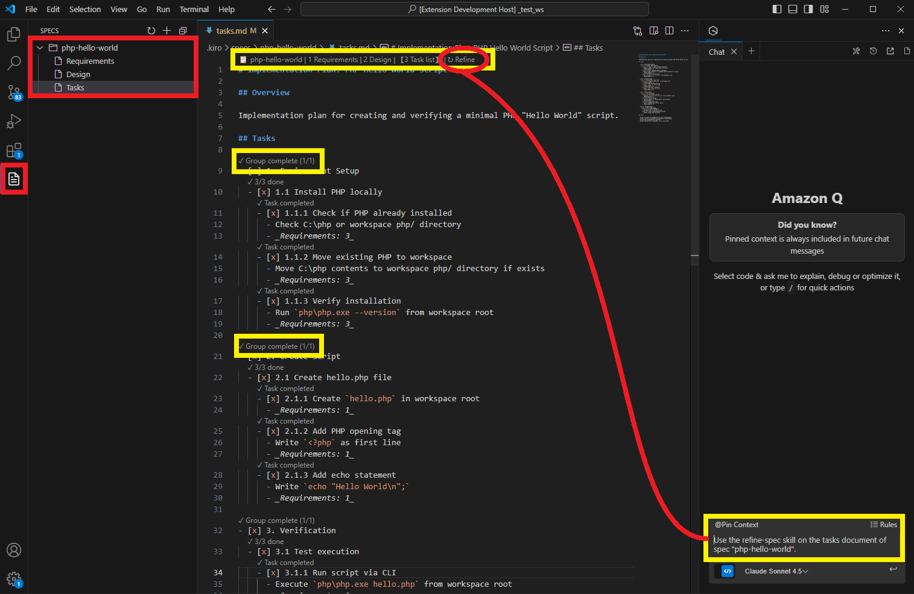

# SDD Studio

A VS Code extension for managing spec-driven development workflows across multiple AI coding agent platforms. Write specs once, work with any AI agent.

AI coding agents each have their own project structure, skill formats, and instruction files — this fragments your workflow when switching tools or collaborating across teams. SDD Studio provides a unified visual interface over its built-in SDD Framework (`src/sdd-framework/`), so you manage specs, skills, and steering documents from one place regardless of which agent you use.

See [VISION.md](VISION.md) for the product roadmap and future direction.



## Installation

Download the latest `.vsix` from [GitHub Releases](https://github.com/ren0xy/sdd-studio/releases), then install it:

**Option A — Command line:**

```bash
code --install-extension sdd-studio-*.vsix
```

**Option B — VS Code UI:**

1. Open VS Code
2. Open the Command Palette (`Ctrl+Shift+P` / `Cmd+Shift+P`)
3. Run **Extensions: Install from VSIX...**
4. Select the downloaded `.vsix` file

## Supported Platforms

| Platform | Instructions File | Skills Path |
|----------|-------------------|-------------|
| Kiro | `.kiro/steering/*.md` | `.kiro/skills/` |
| Claude Code | `CLAUDE.md` | `.claude/skills/` |
| OpenAI Codex | `AGENTS.md` | `.codex/skills/` |
| Google Antigravity | `.agent/rules/specs.md` | `.agent/skills/` |

All platforms share a single spec location: `.kiro/specs/`. That's the whole point.

## How It Works

```
┌──────────────────────────────────────────────────────────────┐
│                        SDD Studio                            │
├──────────────────────────────────────────────────────────────┤
│  React Webview UI (Vite)                                     │
│  ┌──────────┐ ┌───────────┐ ┌──────────┐ ┌──────────────┐   │
│  │  Specs   │ │ Steering  │ │  Skills  │ │   Settings   │   │
│  │  View    │ │   View    │ │   View   │ │     View     │   │
│  └──────────┘ └───────────┘ └──────────┘ └──────────────┘   │
├──────────────────────────────────────────────────────────────┤
│  VS Code Extension Backend                                   │
│  ┌──────────────┐ ┌──────────────┐ ┌──────────────────────┐  │
│  │   Webview    │ │     File     │ │    Platform Status   │  │
│  │   Bridge     │ │   Watchers   │ │        Bar           │  │
│  └──────────────┘ └──────────────┘ └──────────────────────┘  │
├──────────────────────────────────────────────────────────────┤
│  SDD Framework (internal module: src/sdd-framework/)         │
│  ┌──────────┐ ┌──────────┐ ┌──────────┐ ┌──────────────┐    │
│  │   Kiro   │ │  Claude  │ │  Codex   │ │ Antigravity  │    │
│  │ Adapter  │ │  Adapter │ │ Adapter  │ │   Adapter    │    │
│  └──────────┘ └──────────┘ └──────────┘ └──────────────┘    │
└──────────────────────────────────────────────────────────────┘
```

The extension is a thin GUI layer. All platform-specific logic — path resolution, skill transformation, workspace detection — is delegated to the internal SDD Framework module at `src/sdd-framework/`.

## Features

**Spec Management** — List, create, and delete specs. View task trees with status checkboxes (`[ ]` not started, `[-]` in progress, `[x]` completed, `[!]` failed). Click a task to inject its prompt into the active agent panel.

**Steering Documents** — View and manage instruction files for the active platform. Kiro shows a list of steering files; other platforms show their single instructions file.

**Skills** — Browse installed and available skills from the SDD Framework registry. Install or uninstall skills for the current platform.

**Platform Switching** — Status bar shows the active platform. Switch platforms via quick picker; the framework handles workspace transformation while preserving your specs.

**Prompt Injection** — Run buttons on tasks inject implementation prompts into whichever AI agent is active. Falls back to clipboard if injection isn't available.

## Quick Start

```bash
# Clone and install
git clone https://github.com/ren0xy/sdd-studio.git
cd sdd-studio
npm install

# Compile the extension
npm run compile
```

Then press `F5` in VS Code to launch the Extension Development Host.

## Prerequisites

- VS Code 1.85+
- Node.js 20+

## Project Structure

```
sdd-studio/
├── src/                          # VS Code extension backend
│   ├── extension.ts              # Activation, commands, lifecycle
│   ├── webviewProvider.ts        # Webview panel with CSP
│   ├── webviewBridge.ts          # Message routing (VS Code ↔ React)
│   ├── statusBar.ts              # Platform indicator
│   ├── types.ts                  # Shared type definitions
│   ├── parsers/                  # Spec and task parsing
│   │   ├── taskParser.ts
│   │   └── taskSerializer.ts
│   ├── services/                 # Framework wrappers
│   │   ├── platform.ts           # Platform detection and switching
│   │   ├── skills.ts             # Skill registry operations
│   │   ├── steering.ts           # Steering document management
│   │   ├── specs.ts              # Spec CRUD operations
│   │   ├── settings.ts           # Configuration management
│   │   ├── fileWatcher.ts        # Workspace file watchers
│   │   └── promptInjector.ts     # Agent prompt injection
│   └── sdd-framework/            # Inlined framework (runtime-agnostic)
│       ├── adapters/             # Platform adapters (kiro, claude, codex, etc.)
│       ├── commands/             # Framework commands
│       ├── skills/               # Canonical skill definitions
│       ├── tasks/                # Task tracking and group resolution
│       └── ...                   # registry, validation, verification, etc.
├── package.json
├── tsconfig.json
├── eslint.config.mjs             # ESLint with framework boundary rules
└── vitest.config.ts
```

## Message Protocol

The extension and webview communicate via a typed message protocol:

```typescript
// React → VS Code
{ type: 'command', command: 'spec.create', payload: { name: 'user-auth' } }
{ type: 'command', command: 'task.execute', payload: { specName: 'user-auth', taskId: '1.1' } }
{ type: 'command', command: 'platform.switch', payload: { platform: 'claude-code' } }

// VS Code → React
{ type: 'state', data: { specs: [...], platform: 'codex', skills: [...] } }
{ type: 'event', data: { event: 'spec.created', specName: 'user-auth' } }
```

## Development

```bash
npm run compile       # Build extension
npm test              # Run tests (Vitest)
npm run watch         # Watch mode for extension
npm run build:webview # Build React UI
```

## Limitations

- **Prompt injection is best-effort.** Each platform has different extension APIs for chat injection. If the target agent isn't available, prompts are copied to clipboard.
- **AI agent compliance is not guaranteed.** Skills provide instructions; agents interpret them. Results may vary across platforms.

## Related

- [VISION.md](VISION.md) — Product vision, milestones, and future direction

## License

MIT
